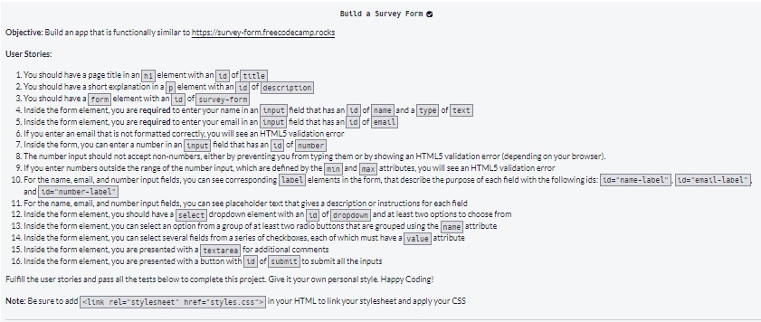
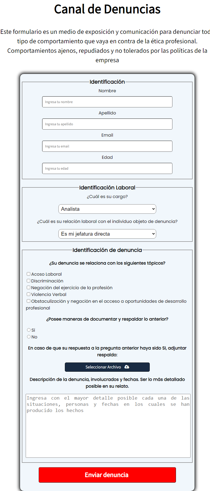

Este repositorio contiene el código del proyecto final del curso 1: Survey Form de la certificación Responsive Web Design. El proyecto consiste en realizar lo siguiente:

Mi proyecto consistio en realizar un formulario de canal de denuncias de individuos que ejercen actos antiéticos y antiprofesionales dentro de una organización en la cual no se comparte ni tolera ese tipo de conductas. He realizado el diseño, estilos y estructura del formulario yendo más allá de los requisitos del proyecto haciendo del formulario responsivo. La screenshot del proyecto es la siguiente:

